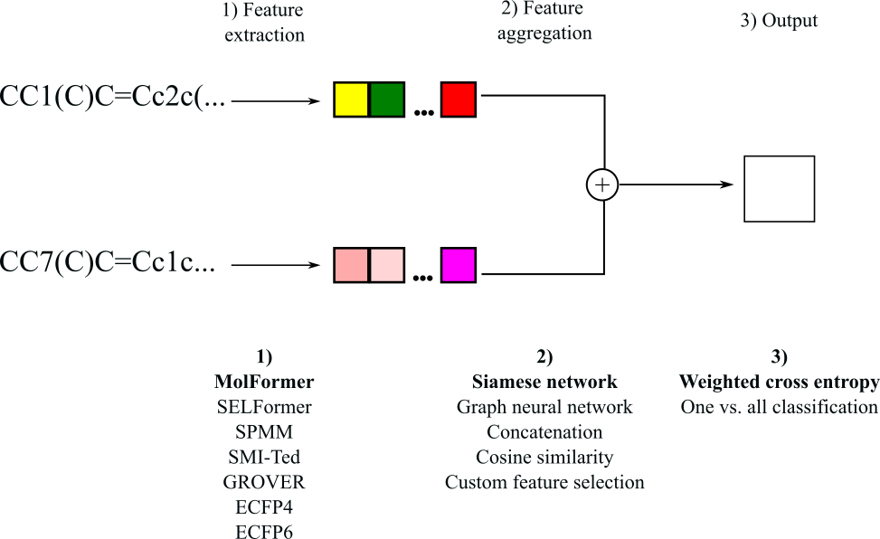

# BioxML Hackathon Enveda Challenge 2: Molecular Similarity

Code for the BioxML Hackathon, where we address Enveda Challenge 2 on determining molecular similarity. 

We have the following pipeline:

